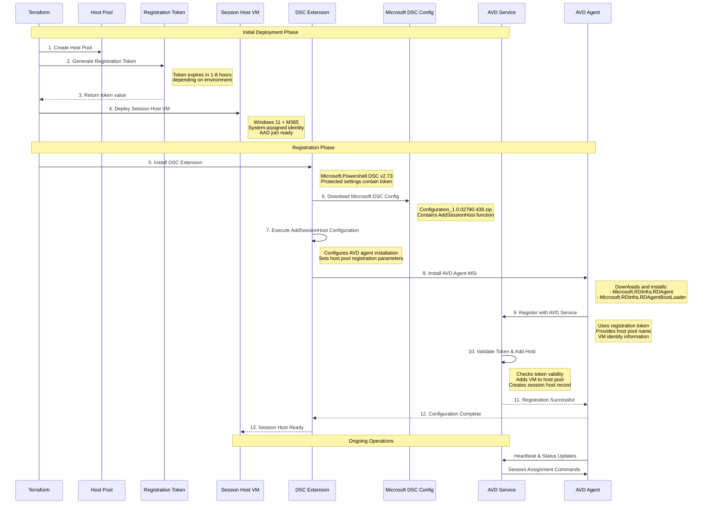

# Azure Virtual Desktop Terraform Configuration (Modular)

This directory contains a **modular Terraform configuration** that deploys Azure Virtual Desktop (AVD) environments supporting **multiple deployment patterns**. The configuration supports pooled desktops, personal desktops, and RemoteApp deployments in both shared and dedicated models.

## Supported Deployment Types

This configuration supports **four distinct AVD deployment patterns**:

| Deployment Type | Description | Use Cases | Resource Sharing |
|-----------------|-------------|-----------|------------------|
| **`pooled_desktop`** | Traditional shared desktop environment | Call centers, task workers, training labs | Multiple users per VM |
| **`personal_desktop`** | Dedicated 1:1 desktop assignments | Developers, power users, persistent workloads | One user per VM |
| **`pooled_remoteapp`** | Shared published applications | Line-of-business apps, legacy applications | Multiple users per VM |
| **`personal_remoteapp`** | Dedicated application access | Sensitive apps, compliance requirements | One user per VM |

## Architecture

This Terraform configuration deploys a complete Azure Virtual Desktop environment with **dynamic configuration** based on the selected deployment type:


### Key Components

| Component | Purpose | Configuration |
|-----------|---------|---------------|
| **Resource Group** | Container for all AVD resources | `rg-{prefix}-{environment}` |
| **Virtual Network** | Isolated network for session hosts | Configurable CIDR (default: 192.168.0.0/24) |
| **Host Pool** | Manages session host capacity and load balancing | **Dynamic**: Pooled or Personal based on deployment type |
| **Application Group** | Defines published resources | **Dynamic**: Desktop or RemoteApp based on deployment type |
| **Workspace** | User-facing portal aggregating app groups | Single workspace per environment |
| **Session Hosts** | Windows 11 VMs running user sessions | **Dynamic**: Shared or dedicated based on deployment type |
| **Published Applications** | Specific apps for RemoteApp deployments | **Conditional**: Only created for RemoteApp types |
| **RBAC Assignments** | Security access control | Desktop Virtualization User + VM User Login roles |

## Deployment Type Configuration Matrix

The configuration automatically adjusts based on the `deployment_type` variable:

| Setting | pooled_desktop | personal_desktop | pooled_remoteapp | personal_remoteapp |
|---------|----------------|------------------|------------------|--------------------|
| **Host Pool Type** | Pooled | Personal | Pooled | Personal |
| **App Group Type** | Desktop | Desktop | RemoteApp | RemoteApp |
| **Load Balancer** | BreadthFirst/DepthFirst | N/A | BreadthFirst/DepthFirst | N/A |
| **Max Sessions** | User-defined | 1 (automatic) | User-defined | 1 (automatic) |
| **Start VM on Connect** | false | true | false | true |
| **Requires Apps** | No | No | Yes | Yes |

### Data Flow

1. **User Authentication**: Users authenticate via Azure AD to access the workspace
2. **Resource Discovery**: Workspace presents available desktops from application groups
3. **Session Allocation**: Host pool assigns users to available session hosts using BreadthFirst load balancing
4. **Connection Establishment**: RDP connection established to assigned session host
5. **Session Management**: Multiple users can share session hosts up to the configured session limit

### Session Host Registration Flow

The following sequence shows how session hosts automatically register with the host pool during deployment:



#### Registration Flow Details

**Phase 1: Infrastructure Setup**
1. **Host Pool Creation**: Terraform creates the AVD host pool resource
2. **Token Generation**: Registration token created with configurable expiration (1-8 hours)
3. **VM Deployment**: Session host VMs deployed with system-assigned managed identity

**Phase 2: DSC Configuration**
4. **DSC Extension Install**: Microsoft.Powershell.DSC extension installed on each VM
5. **Configuration Download**: DSC downloads Microsoft's official configuration zip file
6. **AddSessionHost Execution**: DSC runs the AddSessionHost PowerShell configuration function

**Phase 3: AVD Agent Registration**
7. **Agent Installation**: DSC installs the AVD agent MSI packages
8. **Service Registration**: Agent contacts AVD service using the registration token
9. **Host Pool Membership**: VM added to host pool as available session host

**Phase 4: Verification**
10. **Status Confirmation**: Session host appears in Azure portal under Host Pool → Session hosts
11. **Health Monitoring**: Ongoing heartbeat and status reporting to AVD service

#### Registration Token Security

- **Automatic Expiration**: Tokens expire after deployment to limit security exposure
- **Protected Settings**: Token passed via DSC protected settings (encrypted in Azure)
- **Environment-Specific**: Dev environments use longer expiration (8h), Production uses shorter (1-2h)
- **State Storage**: Token stored in Terraform state - use remote state with encryption for production

#### Troubleshooting Registration

Common registration issues and solutions:

| Issue | Symptoms | Solution |
|-------|----------|----------|
| **Token Expired** | Session host shows "Unavailable" | Re-run `terraform apply` to generate fresh token |
| **Network Connectivity** | DSC fails to download config | Check VM internet access and Azure service endpoints |
| **Permission Issues** | Registration fails with auth errors | Verify VM system-assigned identity permissions |
| **Agent Installation** | DSC reports agent install failure | Check VM has sufficient disk space and admin rights |

### Security Model

- **Network Isolation**: Session hosts deployed in dedicated VNet/subnet
- **Identity Integration**: Azure AD authentication with RBAC-based access control
- **Trusted Launch**: VMs deployed with Secure Boot and vTPM enabled
- **Guest Attestation**: Integrity monitoring for security compliance
- **Managed Identity**: System-assigned identities for VM resource access

## Contents

The configuration is broken into a few logical files:

| File              | Purpose |
| ----------------- | ------- |
| `providers.tf`    | Specifies the required provider versions and configures the AzureRM provider. |
| `variables.tf`    | Declares all variables that can be customised for an environment.  Most defaults come from the supplied ARM template. |
| `main.tf`         | Contains resource definitions for the resource group, network, host pool, application group, workspace, role assignments, NICs, virtual machines and VM extensions. |
| `outputs.tf`      | Exposes key information about the deployment (resource group, host pool name, etc.). |

To deploy this configuration you typically create a variable file such as
`dev.auto.tfvars` or `prod.auto.tfvars` and override values defined in
`variables.tf`.  See the **Using multiple environments** section below for
guidance.

## Prerequisites

* [Terraform 1.2 or later](https://www.terraform.io/downloads.html) and the
  [`azurerm` provider](https://registry.terraform.io/providers/hashicorp/azurerm/latest).
* An Azure subscription with the [Virtual Desktop](https://learn.microsoft.com/en-us/azure/virtual-desktop/) service enabled.
* Object IDs for users, groups or service principals that require access to the
  published desktops.  These IDs are supplied via the `security_principal_object_ids`
  variable.

## Deploying

### Quick Start

1. **Clone** the repository and navigate to the project directory
2. **Set up Azure authentication** using Azure CLI or service principal
3. **Choose your deployment type** by selecting the appropriate `.tfvars` file or creating a custom one
4. **Deploy** using Terraform

### Deployment Type Examples

The repository includes pre-configured examples for each deployment pattern:

#### Pooled Desktop (Traditional AVD)
```bash
# Deploy shared desktop environment for multiple users
terraform init
terraform plan -var-file=dev-pooled-desktop.auto.tfvars
terraform apply -var-file=dev-pooled-desktop.auto.tfvars
```

#### Personal Desktop (Dedicated VMs)
```bash
# Deploy dedicated desktop per user
terraform init
terraform plan -var-file=dev-personal-desktop.auto.tfvars
terraform apply -var-file=dev-personal-desktop.auto.tfvars
```

#### RemoteApp (Published Applications)
```bash
# Deploy published applications environment
terraform init
terraform plan -var-file=dev-pooled-remoteapp.auto.tfvars
terraform apply -var-file=dev-pooled-remoteapp.auto.tfvars
```

#### Production RemoteApp (Dedicated App Access)
```bash
# Deploy dedicated application access for executives/compliance
terraform init
terraform plan -var-file=prod-personal-remoteapp.auto.tfvars
terraform apply -var-file=prod-personal-remoteapp.auto.tfvars
```

### Custom Configuration

Create your own `.tfvars` file with the required settings:

```hcl
# Custom deployment configuration
deployment_type = "pooled_desktop"  # Choose deployment pattern
environment     = "prod"
prefix          = "company"

# Network configuration
vnet_address_space     = ["10.0.0.0/24"]
subnet_address_prefix  = "10.0.0.0/24"

# Deployment-specific settings
session_host_count = 5
max_session_limit  = 6
load_balancer_type = "DepthFirst"  # For pooled types only

# Security
security_principal_object_ids = [
  "user-or-group-object-id-1",
  "user-or-group-object-id-2"
]
admin_password = "SecurePassword123!"

# For RemoteApp deployments, define published applications
published_applications = [
  {
    name                    = "excel"
    display_name           = "Microsoft Excel"
    description            = "Spreadsheet Application"
    path                   = "C:\\Program Files\\Microsoft Office\\root\\Office16\\EXCEL.EXE"
    command_line_arguments = ""
    command_line_setting   = "Allow"
    show_in_portal         = true
  }
]
```

## Multiple environments (dev/test/prod)

Azure best practices recommend organising resources by environment【228828509832038†L113-L133】 and using a consistent naming strategy【902468026142644†L129-L143】.  To support this, the configuration exposes an `environment` variable that is appended to all resource names.  Each environment should be deployed into its own resource group and (ideally) its own subscription to simplify governance and cost management【228828509832038†L113-L133】.  To deploy multiple environments:

1. **Create one variable file per environment.**  For example:

   **`dev.auto.tfvars`**
   ```hcl
   environment                   = "dev"
   location                      = "australiaeast"
   security_principal_object_ids = ["00000000-0000-0000-0000-000000000000"]
   admin_password                = "P@ssword123!"
   tags = {
     owner = "dev-team"
   }
   ```

   **`prod.auto.tfvars`**
   ```hcl
   environment                   = "prod"
   location                      = "australiaeast"
   security_principal_object_ids = ["11111111-1111-1111-1111-111111111111"]
   admin_password                = "AnotherSecureP@ssw0rd!"
   vm_size                       = "Standard_D8ds_v4"
   max_session_limit             = 4
   tags = {
     owner       = "prod-team"
     cost_center = "AVD01"
   }
   ```

2. **Use Terraform workspaces** or run Terraform in separate directories to maintain independent state files for each environment.  A typical workflow looks like:

   ```bash
   terraform init -upgrade
   terraform workspace new dev
   terraform workspace new prod
   terraform workspace select dev
   terraform apply -var-file=dev.auto.tfvars
   terraform workspace select prod
   terraform apply -var-file=prod.auto.tfvars
   ```

3. **Review and adjust** variable values such as VM sizes, number of hosts (`session_host_count`), network ranges and tags to suit each environment’s requirements.

## Best practices

The following recommendations are drawn from the Azure Cloud Adoption Framework and the AVD documentation:

* **Plan your capacity and region placement.**  The resource organisation guidance warns that deploying more than 5,000 VMs in a single region can create performance bottlenecks; organisations with large deployments should use multiple subscriptions and regions【851224553460642†L82-L91】.
* **Keep AVD resources in a single region.**  Host pools, workspaces, session hosts and their network should live in the same Azure region to minimise latency【851224553460642†L95-L105】.  Avoid mixing session hosts from different regions within a host pool【851224553460642†L111-L124】.
* **Separate service objects from compute.**  The Cloud Adoption Framework recommends placing AVD service objects (host pools, application groups, workspaces) in a dedicated resource group and the session host VMs in a separate resource group【851224553460642†L143-L160】.  This configuration simplifies lifecycle management and role assignments.  In this example code, a single resource group is used for simplicity; consider splitting the configuration into modules if your organisation requires stricter separation.
* **Adopt a consistent naming and tagging strategy.**  Azure recommends defining naming conventions early; names should include business and operational details, such as workload, environment and region【902468026142644†L129-L143】.  Tags support cost management, automation and documentation【228828509832038†L117-L127】.
* **Use role‑based access control (RBAC).**  Assign the `Desktop Virtualization User` role on the application group and the `Virtual Machine User Login` role on the session host resource group to grant users access.  The ARM‑based template uses the same roles; this Terraform configuration applies them using the object IDs supplied via `security_principal_object_ids`.
* **Rotate registration tokens regularly.**  The AVD host pool registration token expires after two hours in this configuration.  If you wish to keep the token valid indefinitely, set `type = "Permanent"` and `expiration_date` far in the future.  Keep the token secret—Terraform stores it in state.
* **Use remote state and apply locks.**  When deploying to shared environments (such as production), store your Terraform state in Azure Storage and enable state locking to avoid concurrent modifications.  For example, configure the backend as:

  ```hcl
  terraform {
    backend "azurerm" {
      resource_group_name  = "tfstate-rg"
      storage_account_name = "tfstateacct"
      container_name       = "tfstate"
      key                  = "avd-${var.environment}.tfstate"
    }
  }
  ```

## Differences from the ARM template

The original ARM template created a single session host and nested deployments for the network, control plane and session hosts.  This Terraform configuration:

* Uses native Terraform resources to create the virtual network, subnet and NSG.  The NSG is intentionally empty to match the ARM template’s empty `securityRules` array.
* Creates the host pool, application group and workspace with similar properties (pooled type, BreadthFirst load balancing and desktop preferred application group).
* Generates registration information directly on the host pool and exposes the token via `azurerm_virtual_desktop_host_pool_registration_info.avd.token`.  In the ARM template the token is retrieved via `listRegistrationTokens`; in Terraform it is available as an attribute and used by the **Microsoft DSC extension** for reliable AVD agent installation and registration.
* Leverages count to create multiple NICs, VMs and extensions when `session_host_count > 1`.  The ARM template deploys one VM; you can adjust `session_host_count` to any number your subscription quota allows.
* Uses **Microsoft's official DSC configuration** approach for session host registration, following the same proven method used in Microsoft's ARM templates and documentation.

### Session Host Registration Approach

This configuration uses **Microsoft's official DSC (Desired State Configuration)** approach for registering session hosts with the host pool, following Microsoft's documented best practices:

**DSC-Based Approach (Current Implementation):**
```hcl
resource "azurerm_virtual_machine_extension" "avd_dsc" {
  name                       = "Microsoft.Powershell.DSC"
  publisher                  = "Microsoft.Powershell"
  type                       = "DSC"
  type_handler_version       = "2.73"
  
  settings = <<-SETTINGS
    {
      "modulesUrl": "${var.configuration_zip_file}",
      "configurationFunction": "Configuration.ps1\\AddSessionHost",
      "properties": {
        "HostPoolName": "${azurerm_virtual_desktop_host_pool.avd.name}",
        "aadJoin": true
      }
    }
SETTINGS

  protected_settings = <<PROTECTED_SETTINGS
  {
    "properties": {
      "registrationInfoToken": "${local.registration_token}"
    }
  }
PROTECTED_SETTINGS
}
```

**Benefits of DSC Approach:**
- ✅ **Microsoft-supported method** - Official recommended approach
- ✅ **Proven reliability** - Used in Microsoft's own templates and documentation
- ✅ **Secure token handling** - Registration token passed via protected settings
- ✅ **Automated configuration** - Handles full AVD agent installation and registration
- ✅ **Azure AD join support** - Built-in support for domain-less environments
- ✅ **Error resilience** - Robust retry mechanisms for network issues

## Testing the configuration

This configuration has been tested with Terraform **1.6** and version **3.90** of the Azurerm provider.  It deploys successfully to an Azure subscription with permissions to create resource groups, networking, Azure Virtual Desktop resources and virtual machines.  After deployment, you can verify the results by navigating to **Azure Virtual Desktop → Host pools** in the Azure portal; the session host should appear in the host pool’s **Session hosts** blade.

## Cleaning up

To remove all resources created by this configuration, run:

```bash
terraform destroy -var-file=dev.auto.tfvars
```

You will be prompted to confirm the destruction.  Destroying the resources will remove the host pool, session hosts, network and resource group.

## Key Variables

| Variable | Purpose | Default | Notes |
|----------|---------|---------|-------|
| `environment` | Environment identifier (dev/test/prod) | `"dev"` | Appended to all resource names |
| `session_host_count` | Number of session host VMs to deploy | `1` | Scales the entire VM infrastructure |
| `security_principal_object_ids` | Azure AD object IDs for desktop access | `[]` | **Required**: Must be populated before deployment |
| `admin_password` | Local admin password for session hosts | - | **Required**: Must meet Azure complexity requirements |
| `registration_token_expiration_hours` | Hours until registration token expires | `2` | Longer for dev (8h), shorter for prod (1-2h) |
| `configuration_zip_file` | URL to Microsoft's DSC configuration | Microsoft's official URL | Contains the AddSessionHost DSC configuration |
| `vm_size` | Azure VM size for session hosts | `"Standard_D4ds_v4"` | Choose based on user workload requirements |
| `max_session_limit` | Max concurrent sessions per host | `2` | Balance user experience vs. cost |