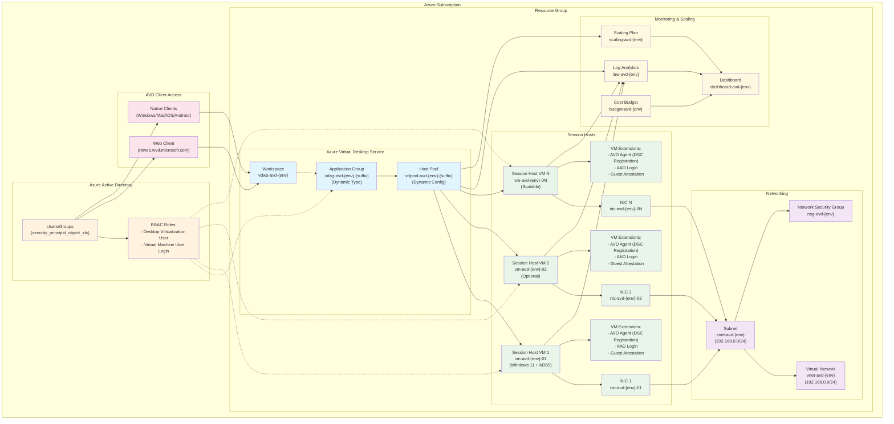

# Azure Virtual Desktop Terraform Configuration

This directory contains a **modular Terraform configuration** that deploys Azure Virtual Desktop (AVD) environments supporting **multiple deployment patterns** with **enterprise-grade monitoring, scaling, and dashboard capabilities**.

**🏆 Enterprise-Grade Features**: 
- **Microsoft Cloud Adoption Framework** naming standards
- **Comprehensive monitoring** with Log Analytics
- **Automatic scaling plans** for cost optimization (40-70% savings)
- **Custom dashboards** for operational insights
- **Cost management** with alerts and budget tracking

## 🚀 Supported Deployment Types

This configuration supports **four distinct AVD deployment patterns**:

| Deployment Type | Description | Use Cases | Resource Sharing | Naming Suffix |
|-----------------|-------------|-----------|------------------|---------------|
| **`pooled_desktop`** | Traditional shared desktop environment | Call centers, task workers, training labs | Multiple users per VM | `desktop` |
| **`personal_desktop`** | Dedicated 1:1 desktop assignments | Developers, power users, persistent workloads | One user per VM | `personal` |
| **`pooled_remoteapp`** | Shared published applications | Line-of-business apps, legacy applications | Multiple users per VM | `apps` |
| **`personal_remoteapp`** | Dedicated application access | Sensitive apps, compliance requirements | One user per VM | `personalapps` |

## 📊 Enterprise Features

### 1. **Scaling Plans** - Cost Optimization
- **Automatic scaling** based on usage patterns
- **Environment-specific schedules** (dev vs prod)
- **Cost savings** of 40-70% for pooled deployments
- **Smart scaling** only for pooled deployments (desktop & RemoteApp)
- **Enterprise-grade architecture**: Uses built-in "Desktop Virtualization Power On Off Contributor" role with subscription-level scope
- **Azure Portal compatibility**: Separate host pool association resource ensures reliable portal integration
- **Best practices**: Random UUID for role assignments, lifecycle management for stability

### 2. **Monitoring & Observability**
- **Log Analytics workspace** with comprehensive logging
- **Diagnostic settings** for all AVD resources
- **Performance metrics** for session hosts
- **Configurable retention** (30-730 days)

### 3. **Custom Dashboards**
- **Real-time insights** for AVD environments
- **Key metrics** display (sessions, performance, costs)
- **Quick navigation** to Azure resources
- **Environment-specific** views

### 4. **Cost Management**
- **Daily cost alerts** with configurable thresholds
- **Budget tracking** with dynamic monthly start dates (auto-calculated from current month)
- **Budget notifications** at 90% and 100% thresholds
- **Cost optimization** recommendations
- **Spending insights** and trends

## Microsoft-Compliant Resource Naming

All resources follow **Microsoft Cloud Adoption Framework** naming standards with deployment-specific suffixes:

| Resource Type | Pattern | Examples |
|---------------|---------|----------|
| **Host Pool** | `vdpool-{prefix}-{environment}-{suffix}` | `vdpool-avd-dev-desktop`, `vdpool-avd-prod-apps` |
| **Application Group** | `vdag-{prefix}-{environment}-{suffix}` | `vdag-avd-dev-personal`, `vdag-avd-prod-personalapps` |
| **Workspace** | `vdws-{prefix}-{environment}` | `vdws-avd-dev`, `vdws-avd-prod` |
| **Subnet** | `snet-{prefix}-{environment}` | `snet-avd-dev`, `snet-avd-prod` |
| **Virtual Network** | `vnet-{prefix}-{environment}` | `vnet-avd-dev`, `vnet-avd-prod` |
| **Network Security Group** | `nsg-{prefix}-{environment}` | `nsg-avd-dev`, `nsg-avd-prod` |

## Architecture

This Terraform configuration deploys a complete Azure Virtual Desktop environment with **dynamic configuration** based on the selected deployment type:



### Key Components

| Component | Purpose | Microsoft-Compliant Name Pattern |
|-----------|---------|----------------------------------|
| **Resource Group** | Container for all AVD resources | `rg-{prefix}-{environment}` |
| **Virtual Network** | Isolated network for session hosts | `vnet-{prefix}-{environment}` ✅ |
| **Subnet** | Session host network segment | `snet-{prefix}-{environment}` ✅ |
| **Host Pool** | Manages session host capacity and load balancing | `vdpool-{prefix}-{environment}-{deployment-suffix}` ✅ |
| **Application Group** | Defines published resources | `vdag-{prefix}-{environment}-{deployment-suffix}` ✅ |
| **Workspace** | User-facing portal aggregating app groups | `vdws-{prefix}-{environment}` ✅ |
| **Session Hosts** | Windows 11 VMs running user sessions | `vm-{prefix}-{environment}-{number}` ✅ |
| **Published Applications** | Specific apps for RemoteApp deployments | **Conditional**: Only created for RemoteApp types |
| **RBAC Assignments** | Security access control | Desktop Virtualization User + VM User Login roles |
| **Log Analytics** | Monitoring and diagnostics | `law-{prefix}-{environment}` ✅ |
| **Scaling Plan** | Automatic cost optimization | `scaling-{prefix}-{environment}` ✅ |
| **Dashboard** | Operational insights | `dashboard-{prefix}-{environment}` ✅ |

**✅ All names follow [Microsoft Cloud Adoption Framework](https://learn.microsoft.com/en-us/azure/cloud-adoption-framework/ready/azure-best-practices/resource-abbreviations) standards**

## Deployment Type Configuration Matrix

The configuration automatically adjusts based on the `deployment_type` variable:

| Setting | pooled_desktop | personal_desktop | pooled_remoteapp | personal_remoteapp |
|---------|----------------|------------------|------------------|--------------------|
| **Host Pool Type** | Pooled | Personal | Pooled | Personal |
| **App Group Type** | Desktop | Desktop | RemoteApp | RemoteApp |
| **Load Balancer** | BreadthFirst/DepthFirst | N/A | BreadthFirst/DepthFirst | N/A |
| **Max Sessions** | User-defined | 1 (automatic) | User-defined | 1 (automatic) |
| **Start VM on Connect** | false | true | false | true |
| **Requires Apps** | No | No | Yes | Yes |
| **Supports Scaling** | Yes | No | Yes | No |

## Pre-configured Deployment Options

### Quick Deployment Matrix

| Environment | Deployment Type | File | Use Case | Resulting Host Pool Name |
|-------------|----------------|------|----------|--------------------------|
| **Development** | Pooled Desktop | `dev-pooled-desktop.auto.tfvars` | Testing, training, call centers | `vdpool-avd-dev-desktop` |
| **Development** | Personal Desktop | `dev-personal-desktop.auto.tfvars` | Developer workstations | `vdpool-avd-dev-personal` |
| **Development** | Pooled RemoteApp | `dev-pooled-remoteapp.auto.tfvars` | App testing, legacy apps | `vdpool-avd-dev-apps` |
| **Production** | Personal RemoteApp | `prod-personal-remoteapp.auto.tfvars` | Executive/compliance apps | `vdpool-avd-prod-personalapps` |

### Enhanced Deployment Options (with Monitoring & Scaling)

| Environment | Deployment Type | File | Features | Use Case |
|-------------|----------------|------|----------|----------|
| **Development** | Pooled Desktop + Monitoring | `dev-pooled-desktop-with-monitoring.auto.tfvars` | Monitoring, Scaling, Dashboards | Development with cost optimization |
| **Production** | Pooled RemoteApp + Monitoring | `prod-pooled-remoteapp-with-monitoring.auto.tfvars` | Monitoring, Scaling, Dashboards | Production apps with insights |
| **Development** | Pooled Desktop + Enhanced Scaling | `dev-pooled-desktop-enhanced-scaling.auto.tfvars` | **NEW**: Built-in role with subscription scope, Advanced schedules, User notifications | Advanced development with enhanced scaling control |

## Scaling Plan Behavior

### Development Environment (Default)
- **Weekdays**: Ramp-up 08:00, Peak 09:00-17:00, Ramp-down 17:00, Off-peak 18:00+
  - Minimum hosts: 20% during ramp-up/peak, 20% during ramp-down
- **Weekends**: Ramp-up 09:00, Peak 10:00-16:00, Ramp-down 16:00, Off-peak 17:00+
  - Minimum hosts: 10% during ramp-up/peak, 10% during ramp-down
- **Aggressive scaling** for maximum cost savings

### Production Environment (Default)
- **Weekdays**: Ramp-up 07:00, Peak 08:00-18:00, Ramp-down 18:00, Off-peak 19:00+
  - Minimum hosts: 30% during ramp-up/peak, 30% during ramp-down
- **Weekends**: Ramp-up 08:00, Peak 09:00-17:00, Ramp-down 17:00, Off-peak 18:00+
  - Minimum hosts: 20% during ramp-up/peak, 20% during ramp-down
- **Conservative scaling** for reliability

**Note**: Schedules are fully customizable via `scaling_plan_schedules` variable. Enhanced scaling deployments may have different schedules.

## Monitoring Capabilities

### Log Analytics Workspace
- **Host Pool Logs**: Connection, error, management, and registration events
- **Session Host Metrics**: CPU, memory, disk, and performance data
- **Custom Queries**: Pre-built queries for common AVD scenarios
- **Retention Options**: 30, 60, 90, 120, 180, 365, or 730 days

### Dashboard Features
- **Session Metrics**: Real-time session data
- **Performance**: Resource utilization
- **Cost Analysis**: Spending insights
- **Health Status**: System health overview
- **Events & Alerts**: Recent activity

## Contents

The configuration is broken into logical files:

| File              | Purpose |
| ----------------- | ------- |
| `providers.tf`    | Specifies the required provider versions and configures AzureRM, AzureAD, Random, and AzAPI providers. |
| `variables.tf`    | Declares all variables that can be customised for an environment. Most defaults come from the supplied ARM template. |
| `main.tf`         | Contains resource definitions for the resource group, network, host pool, application group, workspace, role assignments, NICs, virtual machines, VM extensions, monitoring, scaling, and dashboards. |
| `outputs.tf`      | Exposes key information about the deployment (resource group, host pool name, monitoring insights, etc.). |
| `templates/dashboard.tpl` | Custom Azure dashboard template for operational insights. |

To deploy this configuration you typically create a variable file such as
`dev.auto.tfvars` or `prod.auto.tfvars` and override values defined in
`variables.tf`. See the **Using multiple environments** section below for
guidance.

## Prerequisites

* [Terraform 1.2 or later](https://www.terraform.io/downloads.html) and the required providers:
  * [`azurerm` provider](https://registry.terraform.io/providers/hashicorp/azurerm/latest)
  * [`azuread` provider](https://registry.terraform.io/providers/hashicorp/azuread/latest)
  * [`random` provider](https://registry.terraform.io/providers/hashicorp/random/latest)
  * [`azapi` provider](https://registry.terraform.io/providers/azure/azapi/latest) - Required for session host cleanup operations
* An Azure subscription with the [Virtual Desktop](https://learn.microsoft.com/en-us/azure/virtual-desktop/) service enabled.
* Object IDs for users, groups or service principals that require access to the
  published desktops. These IDs are supplied via the `security_principal_object_ids`
  variable.

## Deploying

### Quick Start

1. **Clone** the repository and navigate to the project directory
2. **Set up Azure authentication** - See [deployment-guide.md](deployment-guide.md#authentication-setup) for detailed authentication setup
3. **Choose your deployment type** by selecting the appropriate `.tfvars` file or creating a custom one
4. **Deploy** using Terraform

### Deployment Type Examples

The repository includes pre-configured examples for each deployment pattern:

#### Pooled Desktop (Traditional AVD)
```bash
# Deploy shared desktop environment for multiple users
terraform init
terraform plan -var-file=dev-pooled-desktop.auto.tfvars
terraform apply -var-file=dev-pooled-desktop.auto.tfvars
```

#### Personal Desktop (Dedicated VMs)
```bash
# Deploy dedicated desktop per user
terraform init
terraform plan -var-file=dev-personal-desktop.auto.tfvars
terraform apply -var-file=dev-personal-desktop.auto.tfvars
```

#### RemoteApp (Published Applications)
```bash
# Deploy published applications environment
terraform init
terraform plan -var-file=dev-pooled-remoteapp.auto.tfvars
terraform apply -var-file=dev-pooled-remoteapp.auto.tfvars
```

#### Production RemoteApp (Dedicated App Access)
```bash
# Deploy dedicated application access for executives/compliance
terraform init
terraform plan -var-file=prod-personal-remoteapp.auto.tfvars
terraform apply -var-file=prod-personal-remoteapp.auto.tfvars
```

#### Development with Monitoring & Scaling
```bash
# Deploy with comprehensive monitoring and cost optimization
terraform init
terraform plan -var-file=dev-pooled-desktop-with-monitoring.auto.tfvars
terraform apply -var-file=dev-pooled-desktop-with-monitoring.auto.tfvars
```

### Custom Configuration

Create your own `.tfvars` file with the required settings:

```hcl
# Custom deployment configuration
deployment_type = "pooled_desktop"  # Choose deployment pattern
environment     = "prod"
prefix          = "company"

# Network configuration
vnet_address_space     = ["10.0.0.0/24"]
subnet_address_prefix  = "10.0.0.0/24"

# Deployment-specific settings
session_host_count = 5
max_session_limit  = 6
load_balancer_type = "DepthFirst"  # For pooled types only

# Monitoring and scaling (optional)
enable_monitoring = true
enable_scaling_plans = true
enable_cost_alerts = true
enable_dashboards = true
monitoring_retention_days = 30
cost_alert_threshold = 100

# Security
security_principal_object_ids = [
  "user-or-group-object-id-1",
  "user-or-group-object-id-2"
]
admin_password = "SecurePassword123!"

# For RemoteApp deployments, define published applications
published_applications = [
  {
    name                    = "excel"
    display_name           = "Microsoft Excel"
    description            = "Spreadsheet Application"
    path                   = "C:\\Program Files\\Microsoft Office\\root\\Office16\\EXCEL.EXE"
    command_line_arguments = ""
    command_line_setting   = "Allow"
    show_in_portal         = true
  }
]
```

## Multiple environments (dev/test/prod)

Azure best practices recommend organising resources by environment and using a consistent naming strategy. To support this, the configuration exposes an `environment` variable that is appended to all resource names. Each environment should be deployed into its own resource group and (ideally) its own subscription to simplify governance and cost management.

To deploy multiple environments:

1. **Create one variable file per environment.** For example:

   **`dev.auto.tfvars`**
   ```hcl
   environment                   = "dev"
   location                      = "australiaeast"
   security_principal_object_ids = ["00000000-0000-0000-0000-000000000000"]
   admin_password                = "P@ssword123!"
   enable_monitoring             = true
   enable_scaling_plans          = true
   tags = {
     owner = "dev-team"
   }
   ```

   **`prod.auto.tfvars`**
   ```hcl
   environment                   = "prod"
   location                      = "australiaeast"
   security_principal_object_ids = ["11111111-1111-1111-1111-111111111111"]
   admin_password                = "AnotherSecureP@ssw0rd!"
   vm_size                       = "Standard_D8ds_v4"
   max_session_limit             = 4
   enable_monitoring             = true
   enable_scaling_plans          = true
   enable_cost_alerts            = true
   tags = {
     owner       = "prod-team"
     cost_center = "AVD01"
   }
   ```

2. **Use Terraform workspaces** or run Terraform in separate directories to maintain independent state files for each environment:

   ```bash
   terraform init -upgrade
   terraform workspace new dev
   terraform workspace new prod
   terraform workspace select dev
   terraform apply -var-file=dev.auto.tfvars
   terraform workspace select prod
   terraform apply -var-file=prod.auto.tfvars
   ```

3. **Review and adjust** variable values such as VM sizes, number of hosts (`session_host_count`), network ranges and tags to suit each environment's requirements.

## Best practices

The following recommendations are drawn from the Azure Cloud Adoption Framework and the AVD documentation:

* **Plan your capacity and region placement.** The resource organisation guidance warns that deploying more than 5,000 VMs in a single region can create performance bottlenecks; organisations with large deployments should use multiple subscriptions and regions.
* **Keep AVD resources in a single region.** Host pools, workspaces, session hosts and their network should live in the same Azure region to minimise latency. Avoid mixing session hosts from different regions within a host pool.
* **Separate service objects from compute.** The Cloud Adoption Framework recommends placing AVD service objects (host pools, application groups, workspaces) in a dedicated resource group and the session host VMs in a separate resource group. This configuration simplifies lifecycle management and role assignments. In this example code, a single resource group is used for simplicity; consider splitting the configuration into modules if your organisation requires stricter separation.
* **Adopt a consistent naming and tagging strategy.** Azure recommends defining naming conventions early; names should include business and operational details, such as workload, environment and region. Tags support cost management, automation and documentation.
* **Use role‑based access control (RBAC).** Assign the `Desktop Virtualization User` role on the application group and the `Virtual Machine User Login` role on the session host resource group to grant users access. The ARM‑based template uses the same roles; this Terraform configuration applies them using the object IDs supplied via `security_principal_object_ids`.
* **Rotate registration tokens regularly.** The AVD host pool registration token expires after two hours in this configuration. If you wish to keep the token valid indefinitely, set `type = "Permanent"` and `expiration_date` far in the future. Keep the token secret—Terraform stores it in state.
* **Use remote state and apply locks.** When deploying to shared environments (such as production), store your Terraform state in Azure Storage and enable state locking to avoid concurrent modifications. For example, configure the backend as:

  ```hcl
  terraform {
    backend "azurerm" {
      resource_group_name  = "tfstate-rg"
      storage_account_name = "tfstateacct"
      container_name       = "tfstate"
      key                  = "avd-${var.environment}.tfstate"
    }
  }
  ```

* **Enable monitoring for all environments.** Use the monitoring features to gain operational insights and optimize costs.
* **Use scaling plans for pooled deployments.** Enable automatic scaling for pooled desktop and RemoteApp deployments to reduce costs by 40-70%.
* **Set up cost alerts for production.** Configure cost thresholds and alerts to prevent budget overruns.

## Differences from the ARM template

The original ARM template created a single session host and nested deployments for the network, control plane and session hosts. This Terraform configuration:

* Uses native Terraform resources to create the virtual network, subnet and NSG. The NSG is intentionally empty to match the ARM template's empty `securityRules` array.
* Creates the host pool, application group and workspace with similar properties (pooled type, BreadthFirst load balancing and desktop preferred application group).
* Generates registration information directly on the host pool and exposes the token via `azurerm_virtual_desktop_host_pool_registration_info.avd.token`. In the ARM template the token is retrieved via `listRegistrationTokens`; in Terraform it is available as an attribute and used by the **Microsoft DSC extension** for reliable AVD agent installation and registration.
* Leverages count to create multiple NICs, VMs and extensions when `session_host_count > 1`. The ARM template deploys one VM; you can adjust `session_host_count` to any number your subscription quota allows.
* Uses **Microsoft's official DSC configuration** approach for session host registration, following the same proven method used in Microsoft's ARM templates and documentation.
* **Adds comprehensive monitoring and scaling capabilities** not present in the original ARM template.

### Session Host Registration Approach

This configuration uses **Microsoft's official DSC (Desired State Configuration)** approach for registering session hosts with the host pool, following Microsoft's documented best practices:

**DSC-Based Approach (Current Implementation):**
```hcl
resource "azurerm_virtual_machine_extension" "avd_dsc" {
  name                       = "Microsoft.Powershell.DSC"
  publisher                  = "Microsoft.Powershell"
  type                       = "DSC"
  type_handler_version       = "2.73"
  
  settings = <<-SETTINGS
    {
      "modulesUrl": "${var.configuration_zip_file}",
      "configurationFunction": "Configuration.ps1\\AddSessionHost",
      "properties": {
        "HostPoolName": "${azurerm_virtual_desktop_host_pool.avd.name}",
        "aadJoin": true
      }
    }
SETTINGS

  protected_settings = <<PROTECTED_SETTINGS
  {
    "properties": {
      "registrationInfoToken": "${local.registration_token}"
    }
  }
PROTECTED_SETTINGS
}
```

**Benefits of DSC Approach:**
- ✅ **Microsoft-supported method** - Official recommended approach
- ✅ **Proven reliability** - Used in Microsoft's own templates and documentation
- ✅ **Secure token handling** - Registration token passed via protected settings
- ✅ **Automated configuration** - Handles full AVD agent installation and registration
- ✅ **Azure AD join support** - Built-in support for domain-less environments
- ✅ **Error resilience** - Robust retry mechanisms for network issues

## Testing the configuration

This configuration has been tested with Terraform **1.6** and version **4.38.1** of the Azurerm provider. It deploys successfully to an Azure subscription with permissions to create resource groups, networking, Azure Virtual Desktop resources and virtual machines. After deployment, you can verify the results by navigating to **Azure Virtual Desktop → Host pools** in the Azure portal; the session host should appear in the host pool's **Session hosts** blade.

## Cleaning up

To remove all resources created by this configuration, run:

```bash
terraform destroy -var-file=dev.auto.tfvars
```

You will be prompted to confirm the destruction. Destroying the resources will remove the host pool, session hosts, network and resource group.

**Important**: If VMs are stopped (due to scaling plans or auto-shutdown), you may encounter extension deletion errors. To avoid this:

1. **Start VMs before destroy** (recommended):
   ```bash
   az vm start --ids $(az vm list -g rg-avd-dev --query "[].id" -o tsv)
   terraform destroy -var-file=dev.auto.tfvars
   ```

2. **Or delete the resource group directly**:
   ```bash
   az group delete --name rg-avd-dev --yes --no-wait
   ```
   This automatically cleans up all resources including extensions.

See the [deployment guide](deployment-guide.md#vm-extension-deletion-errors-vm-stopped) for detailed troubleshooting steps.

## Key Variables

| Variable | Purpose | Default | Notes |
|----------|---------|---------|-------|
| `deployment_type` | AVD deployment pattern | `"pooled_desktop"` | **New**: Determines naming suffix and configuration (`pooled_desktop`, `personal_desktop`, `pooled_remoteapp`, `personal_remoteapp`) |
| `environment` | Environment identifier (dev/test/prod) | `"dev"` | Appended to all resource names following Microsoft standards |
| `prefix` | Project/organization prefix | `"avd"` | Used in all resource names (`vdpool-{prefix}-{environment}-{suffix}`) |
| `session_host_count` | Number of session host VMs to deploy | `1` | Scales the entire VM infrastructure |
| `security_principal_object_ids` | Azure AD object IDs for desktop access | `[]` | **Required**: Must be populated before deployment |
| `admin_password` | Local admin password for session hosts | - | **Required**: Must meet Azure complexity requirements |
| `published_applications` | Applications for RemoteApp deployments | `[]` | **Required for RemoteApp**: List of applications to publish |
| `load_balancer_type` | Load balancing algorithm for pooled types | `"BreadthFirst"` | **New**: `BreadthFirst` or `DepthFirst` (ignored for personal types) |
| `personal_desktop_assignment_type` | Assignment for personal desktops | `"Automatic"` | **New**: `Automatic` or `Direct` user assignment |
| `registration_token_expiration_hours` | Hours until registration token expires | `2` | Longer for dev (8h), shorter for prod (1-2h) |
| `vm_size` | Azure VM size for session hosts | `"Standard_D4ds_v4"` | Choose based on user workload requirements |
| `max_session_limit` | Max concurrent sessions per host | `2` | Balance user experience vs. cost (automatically set to 1 for personal types) |
| `enable_monitoring` | Enable Log Analytics monitoring | `false` | **New**: Enables comprehensive monitoring |
| `enable_scaling_plans` | Enable automatic scaling | `false` | **New**: Cost optimization for pooled deployments |
| `enable_cost_alerts` | Enable cost monitoring alerts | `false` | **New**: Budget tracking and notifications |
| `enable_dashboards` | Enable custom dashboards | `false` | **New**: Operational insights dashboard |
| `monitoring_retention_days` | Log Analytics retention period | `30` | **New**: Choose from 30, 60, 90, 120, 180, 365, 730 days |
| `cost_alert_threshold` | Daily cost threshold for alerts | `100` | **New**: Set based on expected daily costs |
| `dashboard_refresh_interval` | Dashboard refresh interval (minutes) | `15` | **New**: Choose from 5, 15, 30, 60 minutes |

## Terraform Outputs

### New: Microsoft-Compliant Naming Information

The configuration now provides detailed naming information via the `naming_convention` output:

```bash
terraform output naming_convention
```

**Example output:**
```json
{
  "app_group_pattern" = "vdag-avd-dev-desktop"
  "deployment_suffix" = "desktop"
  "follows_standards" = "Microsoft Cloud Adoption Framework"
  "host_pool_pattern" = "vdpool-avd-dev-desktop"
  "subnet_pattern" = "snet-avd-dev"
  "workspace_pattern" = "vdws-avd-dev"
}
```

### Monitoring and Scaling Outputs

```bash
# Check monitoring configuration
terraform output monitoring_insights

# Get quick access links
terraform output quick_links

# Monitor specific resources
terraform output log_analytics_workspace_name
terraform output scaling_plan_name
terraform output dashboard_name

# Check scaling plan configuration details
terraform output scaling_plan_host_pool_association_id
terraform output scaling_plan_role_assignment_id
```

### Other Key Outputs

| Output | Description | Example Value |
|--------|-------------|---------------|
| `host_pool_name` | Microsoft-compliant host pool name | `vdpool-avd-dev-desktop` |
| `application_group_name` | Microsoft-compliant application group name | `vdag-avd-dev-desktop` |
| `workspace_name` | Microsoft-compliant workspace name | `vdws-avd-dev` |
| `deployment_config` | Complete configuration details for the deployment | Configuration object with all settings |
| `published_applications` | List of published apps (RemoteApp only) | Array of application details |
| `session_host_names` | Names of deployed session host VMs | `["vm-avd-dev-01", "vm-avd-dev-02"]` |
| `scaling_plan_host_pool_association_id` | ID of the scaling plan-host pool association | Resource ID string |
| `scaling_plan_role_assignment_id` | ID of the scaling plan role assignment | Resource ID string |

## Support and Documentation

For detailed deployment instructions, troubleshooting, and advanced configuration options, see:

- **[deployment-guide.md](deployment-guide.md)** - Comprehensive deployment guide with examples
- **[DEPENDENCY_FLOW.md](DEPENDENCY_FLOW.md)** - Detailed dependency flow and resource creation order

## Contributing

This configuration follows Microsoft best practices and Azure Cloud Adoption Framework guidelines. When contributing:

1. **Maintain Microsoft-compliant naming** for all resources
2. **Follow the existing code structure** and patterns
3. **Add comprehensive documentation** for new features
4. **Test with multiple deployment types** before submitting
5. **Update example configurations** for new features

---

**🏆 Enterprise-Ready**: This configuration provides production-ready AVD deployments with comprehensive monitoring, scaling, and cost optimization capabilities while maintaining Microsoft Cloud Adoption Framework compliance.