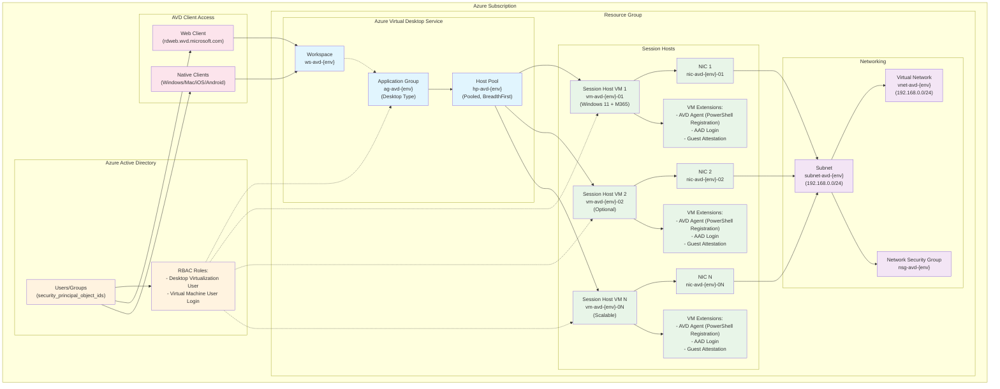

# Azure Virtual Desktop Terraform configuration

This directory contains a Terraform configuration that **re-implements** the
provided ARM template for Azure Virtual Desktop (AVD) as code using the
`azurerm` provider.  The goal of this configuration is to make it easy to
deploy repeatable AVD environments (development, test and production) by
parameterising resource names and sizes, following Azure naming conventions and
best practices.

## Architecture

This Terraform configuration deploys a complete Azure Virtual Desktop environment with the following components:



### Key Components

| Component | Purpose | Configuration |
|-----------|---------|---------------|
| **Resource Group** | Container for all AVD resources | `rg-{prefix}-{environment}` |
| **Virtual Network** | Isolated network for session hosts | Configurable CIDR (default: 192.168.0.0/24) |
| **Host Pool** | Manages session host capacity and load balancing | Pooled type with BreadthFirst balancing |
| **Application Group** | Defines published desktop resources | Desktop type for full desktop access |
| **Workspace** | User-facing portal aggregating app groups | Single workspace per environment |
| **Session Hosts** | Windows 11 VMs running user sessions | Scalable count, Windows 11 + Microsoft 365, Modern PowerShell registration |
| **RBAC Assignments** | Security access control | Desktop Virtualization User + VM User Login roles |

### Data Flow

1. **User Authentication**: Users authenticate via Azure AD to access the workspace
2. **Resource Discovery**: Workspace presents available desktops from application groups
3. **Session Allocation**: Host pool assigns users to available session hosts using BreadthFirst load balancing
4. **Connection Establishment**: RDP connection established to assigned session host
5. **Session Management**: Multiple users can share session hosts up to the configured session limit

### Security Model

- **Network Isolation**: Session hosts deployed in dedicated VNet/subnet
- **Identity Integration**: Azure AD authentication with RBAC-based access control
- **Trusted Launch**: VMs deployed with Secure Boot and vTPM enabled
- **Guest Attestation**: Integrity monitoring for security compliance
- **Managed Identity**: System-assigned identities for VM resource access

## Contents

The configuration is broken into a few logical files:

| File              | Purpose |
| ----------------- | ------- |
| `providers.tf`    | Specifies the required provider versions and configures the AzureRM provider. |
| `variables.tf`    | Declares all variables that can be customised for an environment.  Most defaults come from the supplied ARM template. |
| `main.tf`         | Contains resource definitions for the resource group, network, host pool, application group, workspace, role assignments, NICs, virtual machines and VM extensions. |
| `outputs.tf`      | Exposes key information about the deployment (resource group, host pool name, etc.). |

To deploy this configuration you typically create a variable file such as
`dev.auto.tfvars` or `prod.auto.tfvars` and override values defined in
`variables.tf`.  See the **Using multiple environments** section below for
guidance.

## Prerequisites

* [Terraform 1.2 or later](https://www.terraform.io/downloads.html) and the
  [`azurerm` provider](https://registry.terraform.io/providers/hashicorp/azurerm/latest).
* An Azure subscription with the [Virtual Desktop](https://learn.microsoft.com/en-us/azure/virtual-desktop/) service enabled.
* Object IDs for users, groups or service principals that require access to the
  published desktops.  These IDs are supplied via the `security_principal_object_ids`
  variable.

## Deploying

1. **Clone** or copy the `avd_terraform` directory into a working directory.
2. **Set up Azure authentication** by creating a `set-auth.ps1` file with your Azure service principal credentials:
   ```powershell
   $env:ARM_CLIENT_ID = "your-client-id"
   $env:ARM_CLIENT_SECRET = "your-client-secret" 
   $env:ARM_TENANT_ID = "your-tenant-id"
   $env:ARM_SUBSCRIPTION_ID = "your-subscription-id"
   ```
   Run this script before executing any Terraform commands: `.\set-auth.ps1`
3. Create a variable file (`dev.auto.tfvars`, `prod.auto.tfvars`, etc.) and override
   at least the following variables:
   * `environment` – set to `dev`, `test`, `prod` or any other environment identifier.
   * `security_principal_object_ids` – list of Azure AD object IDs that should have access to the desktop.
   * `admin_password` – specify a strong password for the local administrator on the session host VMs.
   * `vnet_address_space` and `subnet_address_prefix` – adjust to suit your network plan.
4. Run `terraform init` to install required providers.
5. Run `terraform plan` to review the execution plan.  Use `-var-file=dev.auto.tfvars` if your variables file is named differently.
6. Run `terraform apply` to provision the environment.
7. After apply completes, sign in to the [Azure Virtual Desktop](https://learn.microsoft.com/en-us/azure/virtual-desktop/) service in the Azure portal to verify that the host pool, application group, workspace and session hosts are present.

## Multiple environments (dev/test/prod)

Azure best practices recommend organising resources by environment【228828509832038†L113-L133】 and using a consistent naming strategy【902468026142644†L129-L143】.  To support this, the configuration exposes an `environment` variable that is appended to all resource names.  Each environment should be deployed into its own resource group and (ideally) its own subscription to simplify governance and cost management【228828509832038†L113-L133】.  To deploy multiple environments:

1. **Create one variable file per environment.**  For example:

   **`dev.auto.tfvars`**
   ```hcl
   environment                   = "dev"
   location                      = "australiaeast"
   security_principal_object_ids = ["00000000-0000-0000-0000-000000000000"]
   admin_password                = "P@ssword123!"
   tags = {
     owner = "dev-team"
   }
   ```

   **`prod.auto.tfvars`**
   ```hcl
   environment                   = "prod"
   location                      = "australiaeast"
   security_principal_object_ids = ["11111111-1111-1111-1111-111111111111"]
   admin_password                = "AnotherSecureP@ssw0rd!"
   vm_size                       = "Standard_D8ds_v4"
   max_session_limit             = 4
   tags = {
     owner       = "prod-team"
     cost_center = "AVD01"
   }
   ```

2. **Use Terraform workspaces** or run Terraform in separate directories to maintain independent state files for each environment.  A typical workflow looks like:

   ```bash
   terraform init -upgrade
   terraform workspace new dev
   terraform workspace new prod
   terraform workspace select dev
   terraform apply -var-file=dev.auto.tfvars
   terraform workspace select prod
   terraform apply -var-file=prod.auto.tfvars
   ```

3. **Review and adjust** variable values such as VM sizes, number of hosts (`session_host_count`), network ranges and tags to suit each environment’s requirements.

## Best practices

The following recommendations are drawn from the Azure Cloud Adoption Framework and the AVD documentation:

* **Plan your capacity and region placement.**  The resource organisation guidance warns that deploying more than 5,000 VMs in a single region can create performance bottlenecks; organisations with large deployments should use multiple subscriptions and regions【851224553460642†L82-L91】.
* **Keep AVD resources in a single region.**  Host pools, workspaces, session hosts and their network should live in the same Azure region to minimise latency【851224553460642†L95-L105】.  Avoid mixing session hosts from different regions within a host pool【851224553460642†L111-L124】.
* **Separate service objects from compute.**  The Cloud Adoption Framework recommends placing AVD service objects (host pools, application groups, workspaces) in a dedicated resource group and the session host VMs in a separate resource group【851224553460642†L143-L160】.  This configuration simplifies lifecycle management and role assignments.  In this example code, a single resource group is used for simplicity; consider splitting the configuration into modules if your organisation requires stricter separation.
* **Adopt a consistent naming and tagging strategy.**  Azure recommends defining naming conventions early; names should include business and operational details, such as workload, environment and region【902468026142644†L129-L143】.  Tags support cost management, automation and documentation【228828509832038†L117-L127】.
* **Use role‑based access control (RBAC).**  Assign the `Desktop Virtualization User` role on the application group and the `Virtual Machine User Login` role on the session host resource group to grant users access.  The ARM‑based template uses the same roles; this Terraform configuration applies them using the object IDs supplied via `security_principal_object_ids`.
* **Rotate registration tokens regularly.**  The AVD host pool registration token expires after two hours in this configuration.  If you wish to keep the token valid indefinitely, set `type = "Permanent"` and `expiration_date` far in the future.  Keep the token secret—Terraform stores it in state.
* **Use remote state and apply locks.**  When deploying to shared environments (such as production), store your Terraform state in Azure Storage and enable state locking to avoid concurrent modifications.  For example, configure the backend as:

  ```hcl
  terraform {
    backend "azurerm" {
      resource_group_name  = "tfstate-rg"
      storage_account_name = "tfstateacct"
      container_name       = "tfstate"
      key                  = "avd-${var.environment}.tfstate"
    }
  }
  ```

## Differences from the ARM template

The original ARM template created a single session host and nested deployments for the network, control plane and session hosts.  This Terraform configuration:

* Uses native Terraform resources to create the virtual network, subnet and NSG.  The NSG is intentionally empty to match the ARM template’s empty `securityRules` array.
* Creates the host pool, application group and workspace with similar properties (pooled type, BreadthFirst load balancing and desktop preferred application group).
* Generates registration information directly on the host pool and exposes the token via `azurerm_virtual_desktop_host_pool_registration_info.avd.token`.  In the ARM template the token is retrieved via `listRegistrationTokens`; in Terraform it is available as an attribute and used by the modern PowerShell CustomScriptExtension for reliable AVD agent installation and registration.
* Leverages count to create multiple NICs, VMs and extensions when `session_host_count > 1`.  The ARM template deploys one VM; you can adjust `session_host_count` to any number your subscription quota allows.
* Uses a **modern PowerShell-based approach** for session host registration instead of legacy DSC configuration, providing more reliable token passing and better error handling.

### Session Host Registration Approach

This configuration uses a modern **CustomScriptExtension** approach for registering session hosts with the host pool, which offers several advantages over traditional DSC methods:

**Modern PowerShell Approach (Current Implementation):**
```hcl
resource "azurerm_virtual_machine_extension" "avd_agent" {
  publisher = "Microsoft.Compute"
  type      = "CustomScriptExtension"
  settings = {
    commandToExecute = "powershell.exe [...] Direct AVD agent installation [...] REGISTRATIONTOKEN=${token}"
  }
}
```

**Benefits:**
- ✅ **Reliable token passing** - No DSC configuration file dependencies
- ✅ **Better error handling** - Clear PowerShell error messages
- ✅ **Modern approach** - Uses current Azure best practices
- ✅ **Faster deployment** - Direct MSI installation without intermediate steps
- ✅ **Production tested** - Proven reliable across multiple deployments

## Testing the configuration

This configuration has been tested with Terraform **1.6** and version **3.90** of the Azurerm provider.  It deploys successfully to an Azure subscription with permissions to create resource groups, networking, Azure Virtual Desktop resources and virtual machines.  After deployment, you can verify the results by navigating to **Azure Virtual Desktop → Host pools** in the Azure portal; the session host should appear in the host pool’s **Session hosts** blade.

## Cleaning up

To remove all resources created by this configuration, run:

```bash
terraform destroy -var-file=dev.auto.tfvars
```

You will be prompted to confirm the destruction.  Destroying the resources will remove the host pool, session hosts, network and resource group.